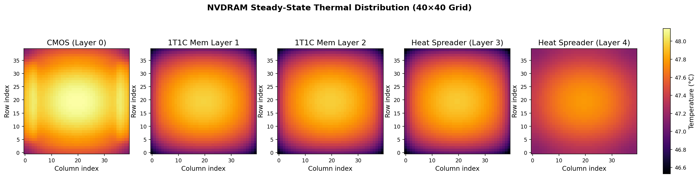
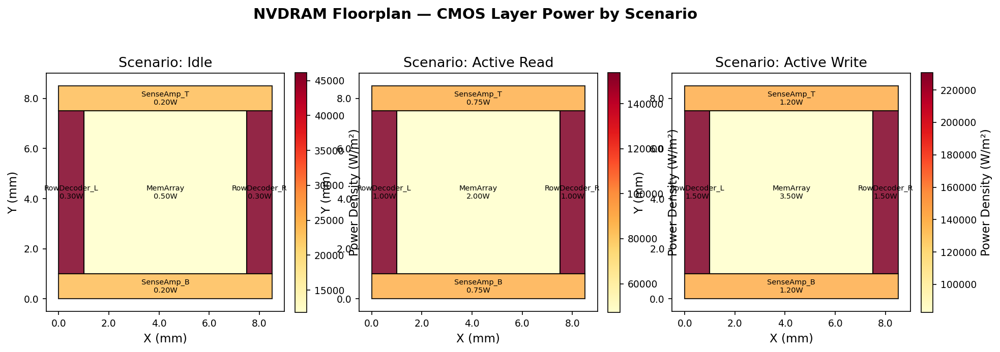
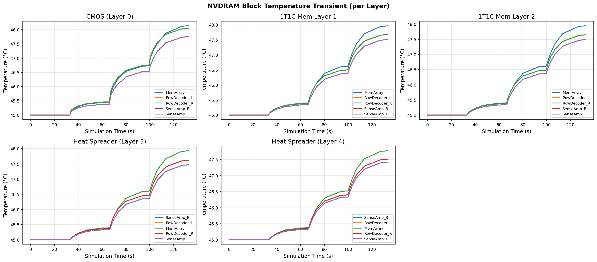
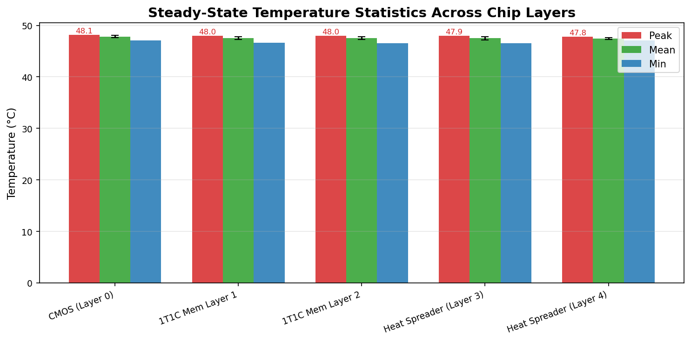
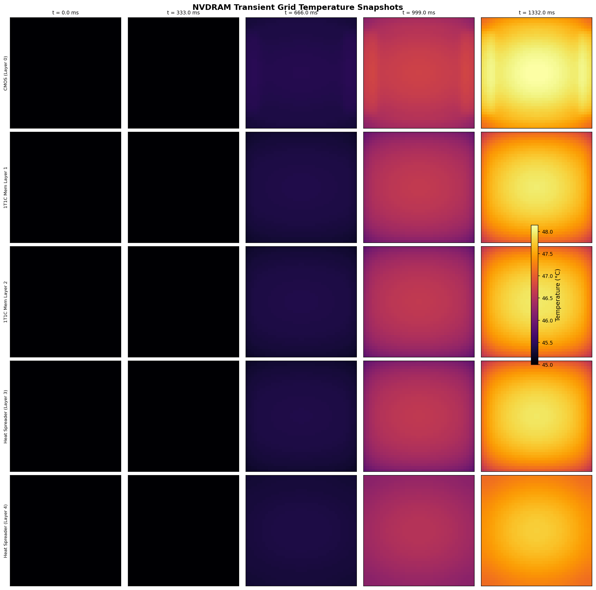
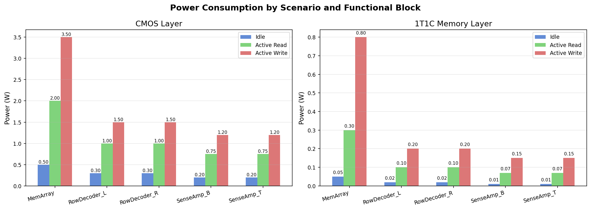
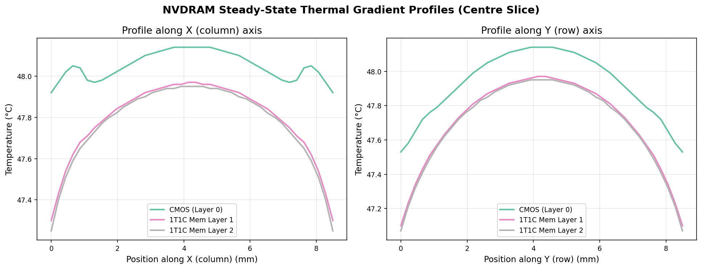
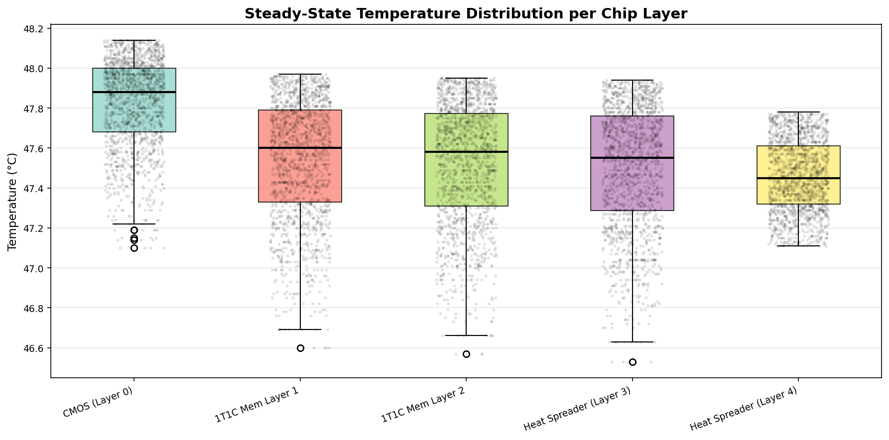

# NVDRAM Thermal Diagrams

This folder contains publication-quality figures generated from PACT thermal simulation outputs for the NVDRAM experiment. All figures are produced by `generate_nvdram_diagrams.py`.

## Generating the Figures

```bash
# From the repo root (uses NVDRAM_Experiment/ by default)
python diagrams/generate_nvdram_diagrams.py

# Or with explicit paths
python diagrams/generate_nvdram_diagrams.py \
    --exp-dir /path/to/NVDRAM_Experiment \
    --out-dir diagrams/
```

**Dependencies:** `matplotlib`, `numpy`, `pandas` (standard scientific Python stack; seaborn is NOT required).

---

## Figure Descriptions

### 1. `steady_state_heatmaps.png`
**Steady-State Thermal Distribution (40×40 Grid)**



One heatmap per chip layer showing the temperature distribution across the full 40×40 simulation grid at steady state. All five layers share a common colour scale so inter-layer temperature differences are directly visible. Hotter regions appear in bright yellow/white; cooler regions in dark purple/black.

- **Source:** `nvdram.grid.steady.layer{0..4}`
- **Units:** °C (converted from Kelvin)
- **Use in paper:** Main thermal characterisation result; shows where hot spots form and how heat concentrates in the memory array versus peripheral decoder/sense-amp blocks.

---

### 2. `floorplan_power_overlay.png`
**Chip Floorplan Coloured by Power Density**



Three side-by-side views of the CMOS layer floorplan, one for each power scenario (Idle, Active Read, Active Write). Each functional block is coloured by its power density (W/m²) and labelled with its absolute power (W). Darker orange/red indicates higher power density.

- **Source:** `nvdram_cmos_flp.csv`, `nvdram_cmos_ptrace.csv`
- **Blocks shown:** MemArray, RowDecoder\_L, RowDecoder\_R, SenseAmp\_B, SenseAmp\_T
- **Use in paper:** Connects the architectural floorplan to the thermal load; illustrates how the write scenario concentrates power in the memory array relative to idle.

---

### 3. `block_transient_temperatures.png`
**Block Temperature Evolution Over Simulation Time**



Line plots of the average block temperature for each functional block across all simulation timesteps, shown separately for each chip layer. Time is derived from the simulation step size (3.33 ms per step, ptrace step = 333 ms).

- **Source:** `nvdram.block.transient.csv`
- **Use in paper:** Demonstrates how quickly the chip reaches thermal equilibrium after a workload change and which blocks are thermally dominant during the transient phase.

---

### 4. `cross_layer_peak_temperatures.png`
**Temperature Statistics Across All Chip Layers**



Grouped bar chart comparing peak, mean, and minimum temperatures for each of the five layers at steady state. Error bars on the mean bars show ±1 standard deviation across all 1,600 grid nodes in that layer.

- **Source:** `nvdram.grid.steady.layer{0..4}`
- **Use in paper:** Quantifies the thermal penalty of 3D stacking; shows that the thin 1T1C memory layers run hotter than the thicker CMOS base layer due to reduced heat dissipation paths.

---

### 5. `transient_grid_snapshots.png`
**Grid Heatmap Snapshots at Five Timesteps**



A grid of heatmaps arranged as (layers × time): each row is one simulated layer, each column is a snapshot at an evenly spaced point in the simulation (t = 0, 25%, 50%, 75%, 100% of total time). The shared colour scale reveals how the thermal landscape evolves.

- **Source:** `nvdram.cir.csv` (full transient grid, 402 timesteps × 4,800 nodes)
- **Use in paper:** Visualises hot-spot formation and propagation dynamics; useful alongside the steady-state heatmaps to distinguish stable versus transient behaviour.

---

### 6. `power_scenarios_comparison.png`
**Power Consumption by Scenario and Functional Block**



Side-by-side grouped bar charts for the CMOS layer (left) and the 1T1C memory layer (right). Each cluster of three bars represents one functional block under Idle, Active Read, and Active Write conditions. Values are labelled on top of each bar.

- **Source:** `nvdram_cmos_ptrace.csv`, `nvdram_mem_ptrace.csv`
- **Use in paper:** Supports the power model section; shows the write-dominated power profile and the large ratio between CMOS and memory-layer power consumption.

---

### 7. `thermal_gradient_profiles.png`
**Thermal Gradient Along X and Y Axes (Centre Slice)**



Line plots of temperature along the horizontal (X) and vertical (Y) centre slices of the chip for the three active simulation layers (CMOS, 1T1C Layer 1, 1T1C Layer 2). Each curve traces temperature from one edge of the chip to the other through the midpoint.

- **Source:** `nvdram.grid.steady.layer{0..2}` (centre row/column index 20 of 40)
- **Use in paper:** Quantifies lateral heat spreading; a flat profile indicates good spreading, a peaked profile highlights localised hot spots. Useful for comparing thermal conductance of Si versus PolySi layers.

---

### 8. `temperature_distribution.png`
**Statistical Temperature Distribution per Layer**



Box-and-whisker plots (with individual data points overlaid as a jitter scatter) for all five chip layers. Each box shows the median, interquartile range, and outliers across all 1,600 grid nodes in that layer.

- **Source:** `nvdram.grid.steady.layer{0..4}`
- **Use in paper:** Summarises thermal uniformity within each layer; a narrow distribution indicates even heat spreading, while a wide spread reveals significant hot-spot formation.

---

## Data Sources Summary

| File | Description |
|------|-------------|
| `nvdram.grid.steady.layer{N}` | 1,600 steady-state node temperatures (40×40 grid) per layer, in Kelvin |
| `nvdram.cir.csv` | Full transient grid trace: 402 timesteps × 4,800 nodes across 3 layers |
| `nvdram.block.transient.csv` | Per-block average temperatures across 400 timesteps and all layers |
| `nvdram_cmos_flp.csv` | CMOS layer floorplan (block positions and dimensions) |
| `nvdram_1t1c_flp.csv` | 1T1C memory layer floorplan |
| `nvdram_cmos_ptrace.csv` | CMOS layer power trace (3 scenarios) |
| `nvdram_mem_ptrace.csv` | Memory layer power trace (3 scenarios) |
